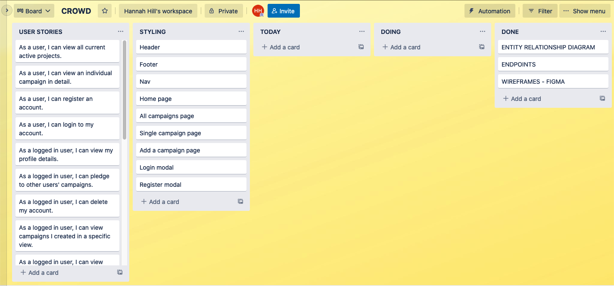
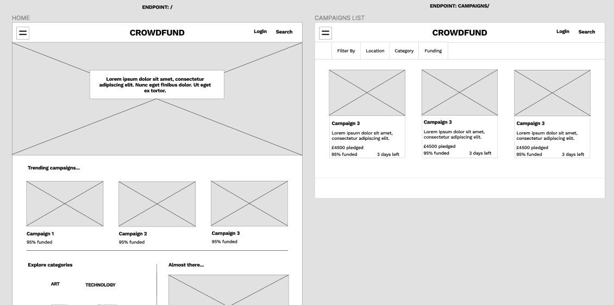
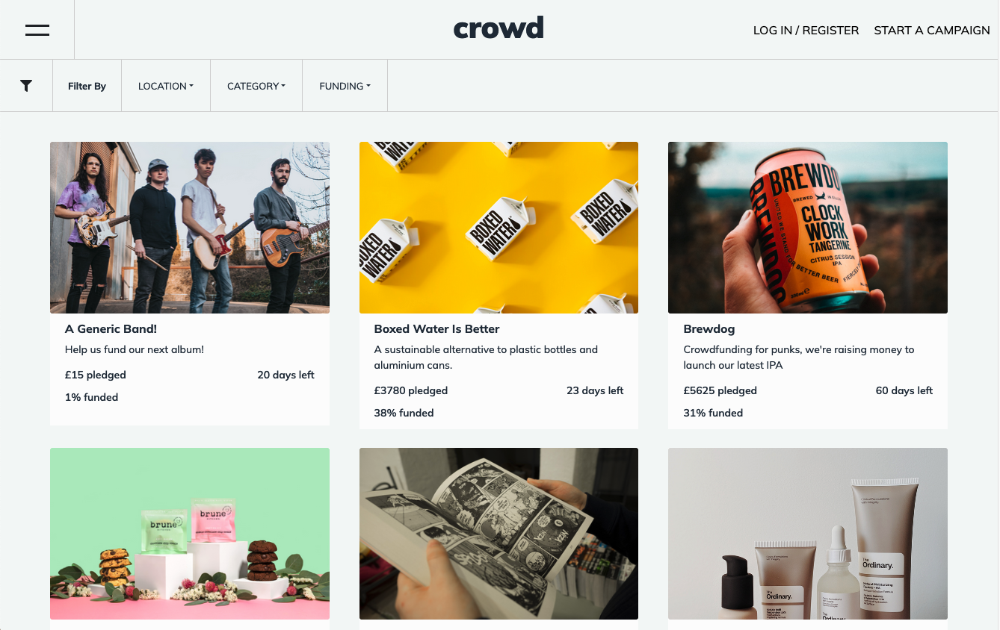
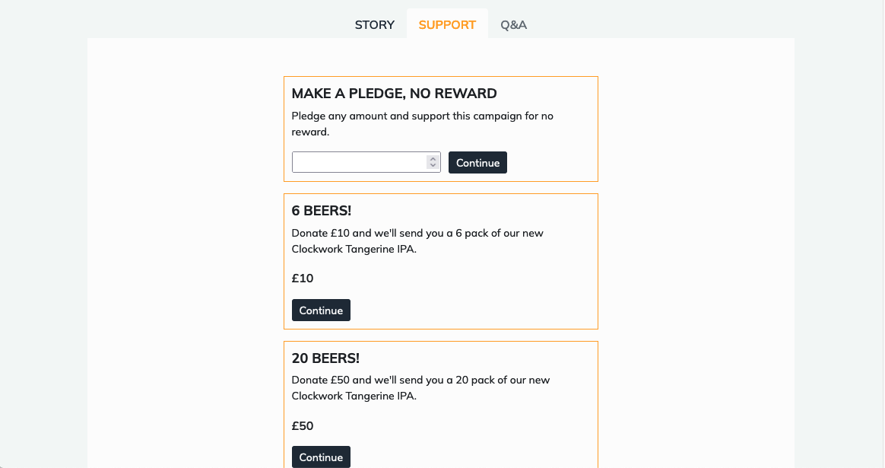
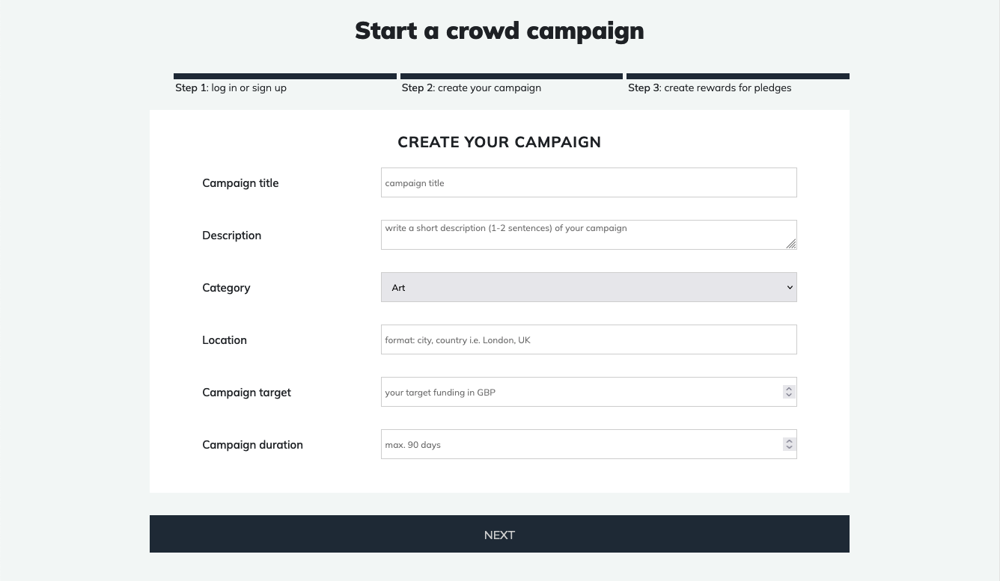

# CROWD - GA PROJECT 04

This is my final project for the General Assembly Software Engineering Immersive course. Crowd is a full-stack web app, built with a Python Django API and React.

Crowd is a kickstarter-style crowdfunding website. Startups and entrepreneurs can post campaigns for crowdfunding, and users can pledge to campaigns in return for rewards.

This app has been deployed with Heroku and is available [here](https://hh-crowd.herokuapp.com/).

Note: Heroku servers are put to sleep after 30 minutes of inactivity, so the site may be slow to load on the first request. After this, it will behave normally.


## TABLE OF CONTENTS

- [Overview](#overview)
- [Planning](#planning)
- [Backend](#backend)
- [Frontend](#frontend)
- [Wins & Challenges](#wins-challenges)
- [Bugs & Known Errors](#bugs)
- [Future Improvements](#improvements)
- [Key Learnings](#learnings)

## OVERVIEW

### TECHNOLOGIES USED

- Python
- Django
- PostgreSQL
- Django REST Framework
- JWT
- JavaScript (ES6)
- React
- Axios
- Sass
- HTTP-proxy-middleware
- React Bootstrap
- React Router

### BRIEF

Build a full-stack application with a React front-end and a Django back-end. It must consume a fully functional RESTful API with all CRUD routes and use multiple relationships. Custom authentication is optional for solo projects.

Wireframes, endpoint mapping, and an entity relationship diagram must be produced prior to development.

## <a name='planning'>PLANNING</a>

Our cohort was given the option to work in pairs, groups, or solo on this project. I opted to work solo, as I wanted to consolidate and test my knowledge by building an entire full-stack app.

I settled on the idea of a crowdfunding website fairly quickly. I wanted to go beyond the usual CRUD app and create something that would require more complex relationships and programming in the backend, but make sure it was achievable as a solo project.

The first step in my planning process was to write user stories. Thinking about the final site from an end user’s perspective really helped me visualise the functionality I wanted to achieve and how to structure my product backlog. I used Trello to keep track of user stories and the development process:



With the functionality defined, I used Lucidchart to map out my ERD, and Figma for endpoints and wireframing.




## <a name='backend'>BACKEND</a>

To build my relational database, I used three models - users, campaigns, pledges - with each model mapping to a single table within a PostgreSQL database.

### USER MODEL

The first model I built was my custom User model. I wanted to add some additional fields to Django’s default User model and also have the possibility to edit the model later during the process if necessary. I mapped the custom fields into the User model and then included the default Django User class attributes in a serializer. I used Django REST Framework to build a serializer that checks the password and confirmation match and hashes the user’s password.

```
from rest_framework import serializers
from django.contrib.auth import get_user_model
import django.contrib.auth.password_validation as validations
from django.contrib.auth.hashers import make_password
from django.core.exceptions import ValidationError
User = get_user_model()


class UserSerializer(serializers.ModelSerializer):

   password = serializers.CharField(write_only=True)
   password_confirmation = serializers.CharField(write_only=True)

   def validate(self, data):

       password = data.pop('password')
       password_confirmation = data.pop('password_confirmation')

       if password != password_confirmation:
           raise serializers.ValidationError({'password_confirmation': 'Passwords do not match'})

       try:
           validations.validate_password(password=password)
       except ValidationError as err:
           raise serializers.ValidationError({'password': err.messages})

       data['password'] = make_password(password)
       return data

   class Meta:
       model = User
       fields = '__all__'
```

I added authentication middleware using JWT, as certain elements of the site, such as pledging towards and creating campaigns would require authorisation. Finally, I created login and register views, again using JWT to encode tokens on login.

### CAMPAIGN MODEL

In addition to the required attributes for a crowdfunding campaign, the campaign model was a central point for many of the relationships that connected the database. Each model had an owner attribute to store a foreign key relating to the user who created it. I also used the campaign model to create a join table for campaign supporters, to store data on which users have pledged towards which campaign.

However, I wanted the intermediate table to store the amount that was pledged, so I added a `through` option to the ManyToMany field to specify which model should be used. I then defined the CampaignSupporters class attributes to include the pledge value.

Within the main Campaign model, I defined two custom methods:
To calculate the total amount funded towards a single campaign, I wrote a method to filter through the CampaignSupporters table and find the sum of the `value` fields.
The rewards (defined in the Pledge model) for each campaign are stored in a Pledge table. The relationship is defined in the Pledge model, so I wrote a method to access the rewards for each campaign by filtering through the Pledge table.

```
class Campaign(models.Model):
   title = models.CharField(max_length=100)
   category = models.CharField(max_length=40)
   location = models.CharField(max_length=100)
   byline = models.CharField(max_length=100, blank=True)
   description = models.TextField(blank=True)
   header_img = models.CharField(max_length=100, blank=True)
   target = models.IntegerField(
       default=1000,
       validators=[
           MaxValueValidator(20000),
           MinValueValidator(10)
       ]
   )
   funded = models.IntegerField(default=0, blank=True)
   created_on = models.DateField(auto_now_add=True)
   duration = models.IntegerField(default=60, validators=[MaxValueValidator(90)])
   supporters = models.ManyToManyField("jwt_auth.User", through='CampaignSupporters', blank=True)
   owner = models.ForeignKey('jwt_auth.User', null=True, on_delete=models.PROTECT, related_name='owner_id')

   def total(self):
       funding = CampaignSupporters.objects.filter(campaign=self,).aggregate(Sum('value'))
       return funding

   def rewards(self):
       rewards = Pledge.objects.filter(campaign=self).order_by('value')
       return rewards

   def __str__(self):
       return self.title


class CampaignSupporters(models.Model):
   campaign = models.ForeignKey("campaigns.Campaign", on_delete=models.PROTECT)
   user = models.ForeignKey("jwt_auth.User", on_delete=models.PROTECT)
   value = models.IntegerField()
```

I then created two serializers for the Campaign and CampaignSupporters tables, as well as an additional serializer which would populate the supporters field, and populate the results of my two methods.

```
from rest_framework import serializers
from jwt_auth.models import User
from jwt_auth.serializers import UserSerializer
from pledges.serializers import PledgeSerializer
from .models import Campaign, CampaignSupporters

class CampaignSerializer(serializers.ModelSerializer):
   class Meta:
       model = Campaign
       fields = '__all__'

class PopulatedCampaignSerializer(CampaignSerializer):
   supporters = UserSerializer(many=True)
   rewards = PledgeSerializer(many=True)

   funding = serializers.ReadOnlyField(
       source='total'
   )

class CampaignSupportersSerializer(serializers.ModelSerializer):
   class Meta:
       model = CampaignSupporters
       fields = '__all__'
```

I created my urls and views, building CRUD functionality for campaigns as well as some custom views for trending campaigns and categories which I wanted for my frontend. I also wrote a view to add data to the CampaignSupporters table which, as mentioned above, required an extra `value` field.

```
class PledgeView(APIView):
   def post(self, request, pk):
       try:
           campaign = Campaign.objects.get(id=pk)
           value = request.data['value']
           print(value)
           user = request.user
           new_pledge = CampaignSupporters.objects.create(user=user, value=value, campaign=campaign)
           return Response(status=status.HTTP_202_ACCEPTED)
       except Exception as e:
           print(e)
           return Response(status=status.HTTP_400_BAD_REQUEST)

...

urlpatterns = [
   # path('campaigns/', views.home, name='home'),
   path('', CampaignListView.as_view()),
   path('<int:pk>/', CampaignDetailView.as_view()),
   path('<int:pk>/pledge/', PledgeView.as_view()),
   path('trending/', CampaignTrendingView.as_view()),
   path('categories/', CategoryView.as_view())
]
```

### PLEDGE MODEL

The final model is the Pledge model. The Pledge table contains data for the different rewards each campaign offers to users who pledge, and uses a foreign key to reference the campaign. I built in CRUD functionality in my views, so users could customise the rewards they offer to users in return for pledges.

```
class Pledge(models.Model):
   title = models.CharField(max_length=100)
   description = models.CharField(max_length=250)
   value = models.IntegerField()
   campaign = models.ForeignKey('campaigns.Campaign', on_delete=models.PROTECT, related_name='rel_campaign')

   def __str__(self):
       return self.title
```

The main Django project handles requests from the frontend and routes them to the correct model’s URLs.

I used Postbird to visualise my PostgreSQL database and Insomnia to test my backend requests, ensuring that my endpoints were correct and I was receiving the right responses.

I had initially hoped to add in a model for comments, but after completing the work on the three models above, my endpoints list was already looking long and I was concerned about frontend development time. I decided to move on to the frontend, and leave comments as a stretch goal if I had time. Despite this, I was really happy with the backend build and hadn’t experienced any major setbacks, bar a bit of time lost (but not wasted!) in Django documentation.

## <a name='frontend'>FRONTEND</a>

With the backend fresh in my mind, I started my work on the frontend by writing an API request library, where axios requests can be imported to the relevant page. Navigation was handled by React-router and I used Sass to write my own CSS styling. I supplemented some elements with React Bootstrap, such as the offcanvas nav.

#### Home


#### All campaigns



#### Single campaign




#### Start a campaign




## <a name='wins-challenges'>WINS & CHALLENGES</a>

This was my first time working with Django and Python, and I was really happy that I managed to get some complex relationships, particularly in elements such as creating custom join tables. A lot of this came down to reading the Django documentation, which is a skill I’m glad I worked on during this project.

In my previous full-stack group project, I had generally manipulated data on the frontend. However, in this project, instead of staying in my JavaScript comfort zone, I used Python and Django to code specific views to filter through the database, for example to get trending campaigns (most pledges) for the home page.

In terms of challenges, it initially took me a while to wrap my head around the relational structure of SQL databases and how the different tables work together. I got stuck with the concept that relationships should only exist in one place, rather than on both models. However, I’m really glad I encountered this issue because it made me understand custom methods to add row-level functionality to a model.

## <a name='bugs'>BUGS & KNOWN ERRORS</a>

When you pledge to a campaign, the funding amount does not automatically update and you have to reload the page to see your pledge add to the total. I need to trigger the component to re-render after the ‘continue to payment’ modal.

The login functionality broke towards the end of development, with Django's built in `check_user()` method returning False when provided with correct credentials.

The add a campaign form does not have responsive styling.

## <a name='improvements'>FUTURE IMPROVEMENTS</a>

As mentioned above, I styled filters onto the browse all campaigns page, but these are not currently functional. I’d like to add in filtering by category, location, etc. Similarly, on the home page there is a list of all the categories currently used by campaigns - I would like to make these clickable to a filtered page.

I had originally envisioned an account section, where users could see their own campaigns and a history of their activity (i.e. campaigns they have pledged to, how much etc.).

Add in a comments-style Q&A section to each campaign, where users can post comments or questions for the campaign owner to respond to.

## <a name='learnings'>KEY LEARNINGS</a>

This was my first project working with Python and Django, and I learned a lot about relational databases and the ease that Django’s ORM offers.

Building the entire app solo, I also consolidated my understanding of React, particularly regarding Hooks and passing props and state between components.

Time management! This was a great opportunity to learn what I am capable of when working alone, and how much is achievable. My previous full-stack project had been a group project, so working solo was a new challenge - there wasn’t someone there to balance out weaknesses and more time was spent overcoming blockers. I was definitely optimistic during planning about how much I could achieve in the time frame.

However, I’m really happy I chose to work alone. Building each and every element of a full-stack app really cemented my learnings from the course and turned weaknesses into strengths. In addition, this project marked the end of my Software Engineering Immersive bootcamp, and has been a huge confidence boost for me as I enter a new industry.
